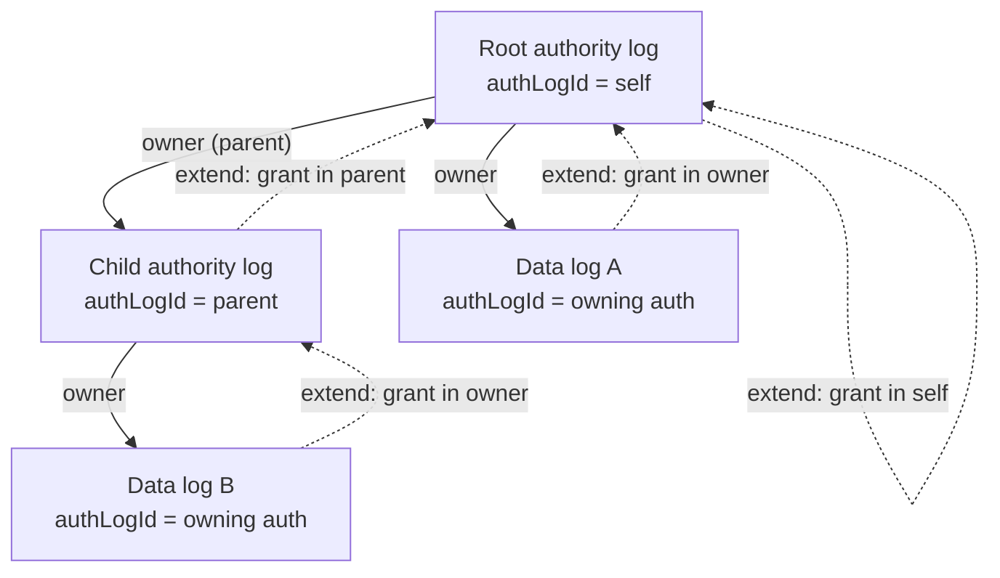
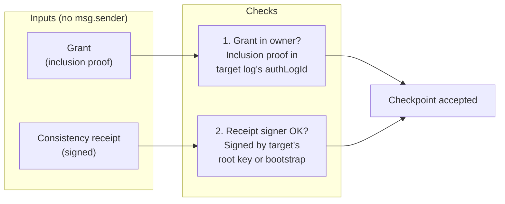
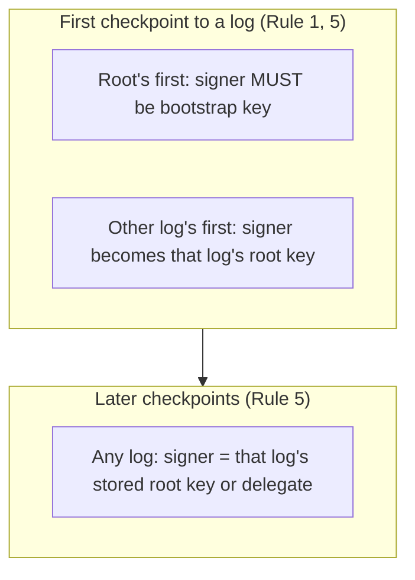
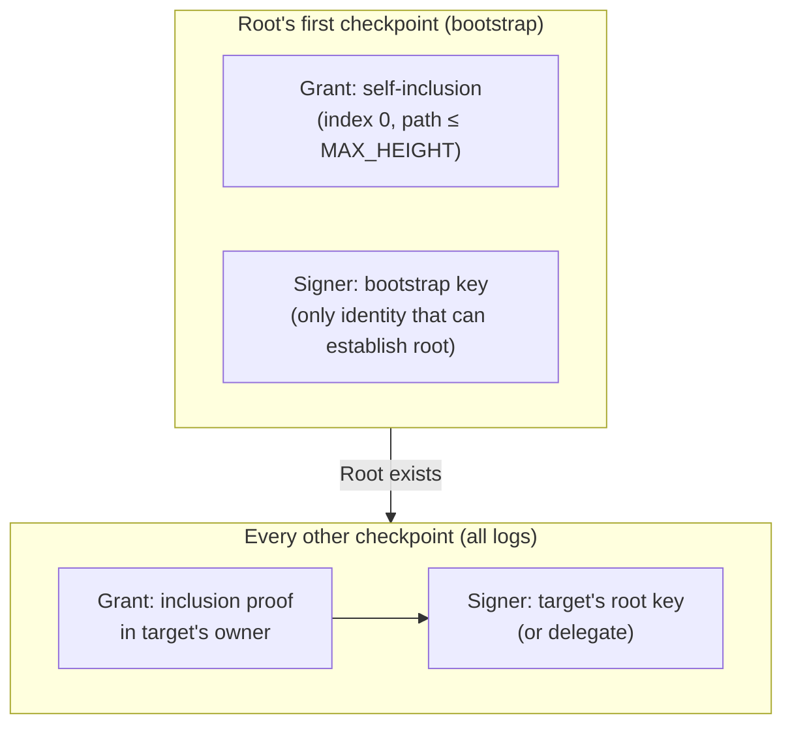
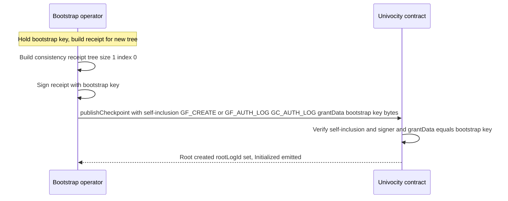
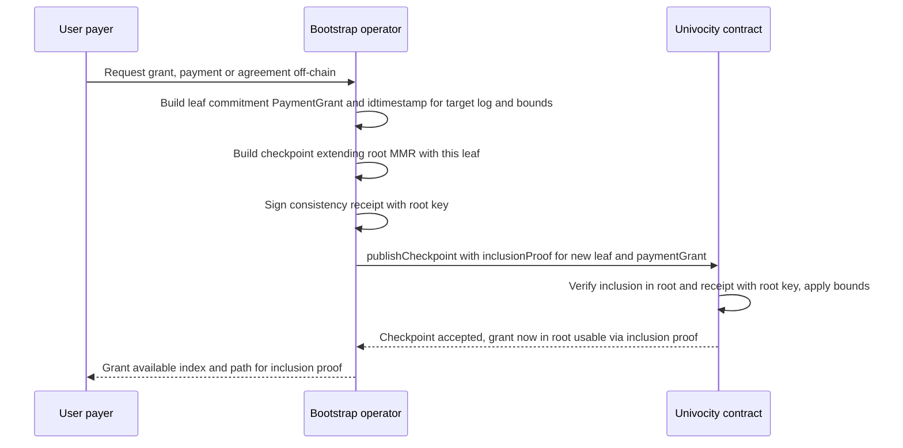
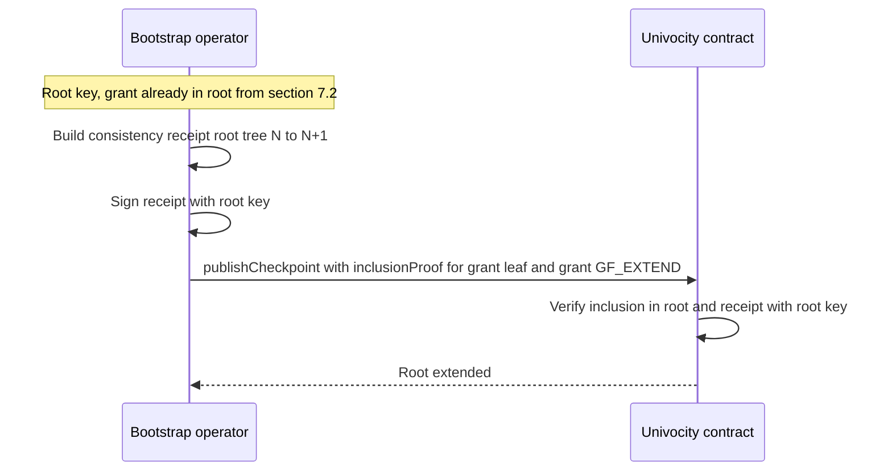
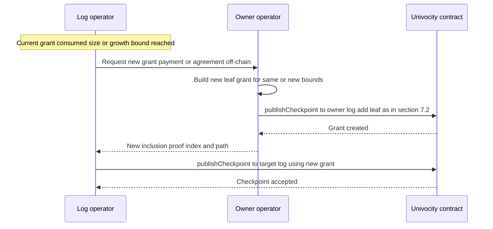
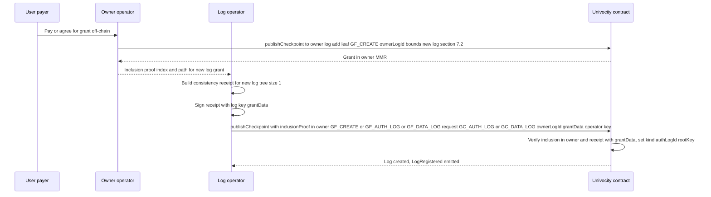
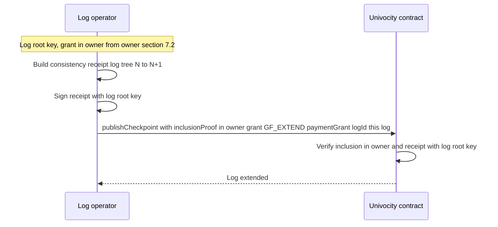

# ARC-0017: Authorization model overview

**Status:** DRAFT  
**Date:** 2026-02-23  
**Related:** [ARC-0017 (log hierarchy)](arc-0017-log-hierarchy-and-authority.md),
[ARC-0016](arc-0016-checkpoint-incentivisation-implementation.md),
[ADR-0004](../adr/adr-0004-root-log-self-grant-extension.md)

Succinct diagrams for the univocity authorization model. The same two
checks apply to **every** checkpoint: (1) **grant** = inclusion proof in
the target log’s **owner**, and (2) **consistency receipt** signed by the
target log’s **signer** (or, on first checkpoint, establishing it). The
only special case is the root’s first checkpoint, where there is no prior
owner and the signer must be the bootstrap key.

**Caller identity is not part of the model.** Anyone may call
`publishCheckpoint`; the contract never checks `msg.sender` for
authorization. Valid grant + validly signed checkpoint are sufficient.
Whoever pays gas is the submitter (emitted in events for attribution).

---

## 1. Log hierarchy and “owner”

Every log has an **owner** (`authLogId`): the log against which the grant
(inclusion proof) must be verified. Authority logs form a tree; data logs
are owned by an authority log.

**Rules 2 & 3:** To extend a log, the grant is always an inclusion proof
**in that log’s owner** (root → self; child authority → parent; data log
→ owning authority). First checkpoint to a new log requires
`ownerLogId` in the grant and inclusion verified against that owner.

---

## 2. Same authorization for every checkpoint

For **any** checkpoint (root, child auth, or data log; first or later),
two things are checked. The only variation is *which* owner and *which*
signer.

| Target | Owner (where grant is verified) | Signer (who must sign receipt) |
|--------|--------------------------------|--------------------------------|
| **Root, first checkpoint** | — (self-inclusion in new tree, index 0) | **Bootstrap key** (prevents front-running) |
| **Root, later** | Root (self) | Root’s stored root key |
| **Child auth, first** | Parent log | Key that will become root (stored) |
| **Child auth, later** | Parent log | Child’s stored root key |
| **Data log, first** | Owning auth log | Key that will become root (stored) |
| **Data log, later** | Owning auth log | Data log’s stored root key |

**Rule 1 (bootstrap):** Root’s first checkpoint is the one case with no
prior log; grant is self-inclusion. The signer constraint is **bootstrap
key** so only that identity can establish the root. After that, root
behaves like any other log (grant in self, signer = root’s root key).

**Rules 4 & 5:** Grant bounds (minGrowth, maxHeight) and receipt
signature verification complete the model. No role for `msg.sender`.

---

## 3. Checkpoint signers (who signs the receipt)

The **consistency receipt** is always signed by a key. The contract
verifies that signature; it does **not** verify the caller.

- **Root, first:** Receipt must be signed by the **bootstrap key**
  (contract config). The signer key is supplied in **grantData**
  (verify-only; no on-chain recovery). grantData must equal the bootstrap
  key bytes. No grant-based protection yet, so the signer is constrained
  to prevent front-running.
- **Any other first:** The signer key is supplied in **grantData**
  (verify-only). The contract verifies the receipt against that key and
  stores it as that log’s **root key**. Future checkpoints to that log
  must be signed by that key (or a delegate).
- **Any later:** Receipt must verify against the **stored root key** for
  that log (or a valid delegation from it).

**msg.sender** is never used for these checks. The submitter is whoever
calls `publishCheckpoint` (and pays gas); they are only recorded in
events.

**Delegation.** Signer delegation is supported: a delegate key may sign
the consistency receipt when authorized by the log’s root key (delegation
proof). For the **first checkpoint**, **grantData** supplies the root key;
the contract verifies the delegation and receipt against it (verify-only;
no on-chain recovery) and stores it as root key. For later checkpoints
with delegation, the stored root must match the key used to verify the
delegation (and the delegate signs the receipt). Allowed algorithms and
delegation support:

| Algorithm | Description        | Delegation |
|-----------|--------------------|------------|
| **ES256** | P-256 + SHA-256    | Yes        |
| **KS256** | secp256k1 + Keccak-256 | No     |

---

## 4. Bootstrap in the same frame

Bootstrap is the **single** special case: the first checkpoint ever has no
owner log yet, so “grant in owner” becomes “self-inclusion” and “signer”
is fixed to the bootstrap key. Once the root exists, it follows the same
rules as every other log.

**Rule summary:**

| Rule | What it does |
|------|----------------|
| **1** | Root’s first: self-inclusion + receipt signer = bootstrap key. Submission permissionless. |
| **2** | Grant = inclusion proof in target log’s owner (authLogId). |
| **3** | First checkpoint to new log needs ownerLogId and inclusion in that owner. |
| **4** | Grant bounds: minGrowth, maxHeight (size-only). |
| **5** | Receipt must verify against target’s root key (or bootstrap for root’s first). |

---

## 5. What is not in the model

- **msg.sender** is not used for authorization. Any address may call
  `publishCheckpoint` with a valid grant and validly signed checkpoint.
- **Payer** is part of the grant (leaf commitment) for attribution only;
  the contract does not require `msg.sender == payer`.
- **Submitter** is whoever called the method; they are emitted in
  `CheckpointPublished` for indexing and attribution only.

The only on-chain authorization is: **grant in owner** + **receipt
signed by the correct key**.

---

## 6. Grant vs request (first-checkpoint log kind)

- **Grant** (in the leaf commitment): flags GF_CREATE, GF_EXTEND, GF_AUTH_LOG,
  GF_DATA_LOG — what the leaf allows (create and/or extend; allow auth and/or
  data log).
- **Request** (not in the leaf hash): high 32 bits = GC_AUTH_LOG or GC_DATA_LOG
  (mutually exclusive). For the first checkpoint to a new log, request
  selects the log kind; it must be allowed by the grant (e.g. request
  GC_AUTH_LOG requires GF_AUTH_LOG). Extend checkpoints use GF_EXTEND; request
  is irrelevant for kind. Rules 1–3 enforce grant and request consistency.

---

## 7. Operator flows (off-chain services)

This section describes the **intended design of the off-chain services** that
operate logs and are organised into a logical hierarchy by the authorization
model. Sequence diagrams are from the perspective of the **bootstrap log
operator**, **subsequent log operators** (e.g. data log or child authority),
and **user** (payer / consumer), covering grant creation, first checkpoint,
subsequent checkpoints, and refresh of GF_EXTEND grants.

### 7.1 Bootstrap log operator: create root (first checkpoint ever)

The bootstrap operator holds the bootstrap key. Creating the root is the one
flow that does not require a prior grant; the grant is self-inclusion
(index 0) in the new tree.

### 7.2 Bootstrap log operator: creating grants

A **grant** is a leaf in an authority log’s MMR. The bootstrap operator
**creates** a grant by publishing a checkpoint to the root that adds a leaf
whose commitment encodes the grant (logId, payer, GF_*, bounds, ownerLogId,
grantData). That leaf can allow extending the root (GF_EXTEND) or creating
or extending another log (GF_CREATE, GF_EXTEND, GF_AUTH_LOG, GF_DATA_LOG).

### 7.3 Bootstrap log operator: extending root (subsequent checkpoint)

After the root exists, extending it requires a **grant** that is already a
leaf in the root (GF_EXTEND, typically for root’s own logId). The operator
uses an inclusion proof for that leaf.

### 7.4 Refreshing GF_EXTEND grants

Grants are **growth-bounded** (maxHeight, minGrowth). When a log has
consumed a grant (size at or near maxHeight, or growth exhausted), no further
checkpoints can use that leaf. The **owner** of the log must issue a **new**
grant (new leaf in the owner’s MMR). For a data log, the operator obtains a
new grant from the bootstrap (or parent) operator; for a child authority,
from the parent. For the **root**, the owner is the root itself, so the
bootstrap operator must add a new self-grant by publishing a checkpoint to
the root that adds a new leaf (§7.2).

**Root bootstrap operator: can they recover if their GF_EXTEND grant
expires?** To publish *any* checkpoint to the root (including the one that
adds a new leaf), the submitter must supply an **inclusion proof** — i.e. a
grant that is already a leaf in the root. So to add the *next* grant leaf,
the operator must use an *existing* grant to publish that checkpoint. **If
the root operator’s only GF_EXTEND grant is fully consumed (expired), they
cannot unilaterally publish a new self-grant** — they have no leaf to use as
inclusion proof, so they are **locked out** unless another party that still
holds a valid grant in the root submits the checkpoint that adds a new leaf
(which can encode a grant for the root operator). **Operational requirement:**
the root operator must **refresh before expiry**: use the current grant to
publish the checkpoint whose new leaf is the next self-grant, so that grant
N+1 exists before grant N is exhausted. The same principle applies to any
log whose owner is itself (root): always add the next grant leaf while the
current one is still valid.

**Expected practice vs optional model.** In practice, the root operator
typically sets an (effectively) **infinite** max_size on their initial
self-grant and sets both GF_CREATE and GF_EXTEND, so the root does not need
to refresh and lockout is not a practical concern. Some deployments may
instead choose the **must-refresh** model (bounded max_size and periodic
refresh) as a soft guarantee of liveness — e.g. to ensure the operator
periodically proves control or to bound exposure.

### 7.5 Subsequent log operator: first checkpoint (create log)

A **data log** or **child authority** is created when the first checkpoint is
published to a new logId. The operator must hold a **grant** from the owner
(inclusion proof in the owner’s log) with GF_CREATE and the appropriate
request (GC_AUTH_LOG or GC_DATA_LOG). The operator supplies **grantData** =
their public key (verify-only); the contract stores it as that log’s root key.

### 7.6 Subsequent log operator: subsequent checkpoints (extend log)

To extend an existing (non-root) log, the operator uses a **grant** with
GF_EXTEND that is a leaf in the log’s **owner** (authLogId). The consistency
receipt is signed by that log’s **root key** (established at first checkpoint).

### 7.7 Summary: hierarchy of off-chain services

| Role | Owns / operates | Creates grants by | First checkpoint | Later checkpoints | Refresh |
|------|-----------------|-------------------|------------------|-------------------|---------|
| **Bootstrap operator** | Root authority log | Publishing checkpoints to root (leaf = grant) | Create root (§7.1) | Extend root (§7.3) with GF_EXTEND grant | New leaf in root (§7.2) |
| **Data log operator** | Data log (owner = root or child auth) | — | First to log (§7.5) with grant from owner | Extend log (§7.6) with GF_EXTEND grant from owner | Request new grant from owner (§7.4) |
| **Child authority operator** | Child authority (owner = parent) | Publishing checkpoints to child (leaf = grant for data under child) | First to child (§7.5) with grant from parent | Extend child (§7.6) with GF_EXTEND grant from parent | Request new grant from parent (§7.4) |
| **User** | — | — | May pay for grant; submitter may be user or operator | May pay for grant; submitter may be user or operator | Request new grant from owner |
