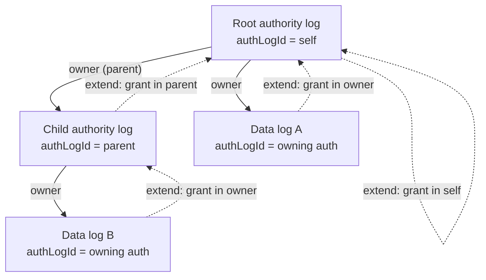
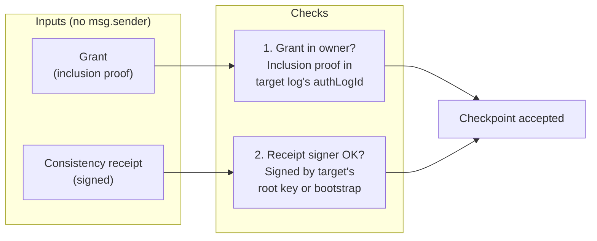
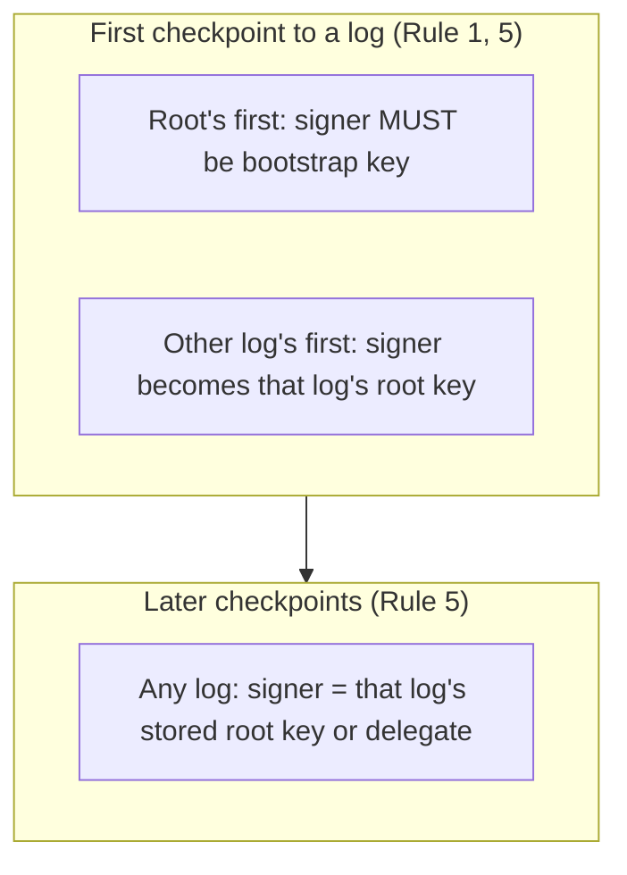
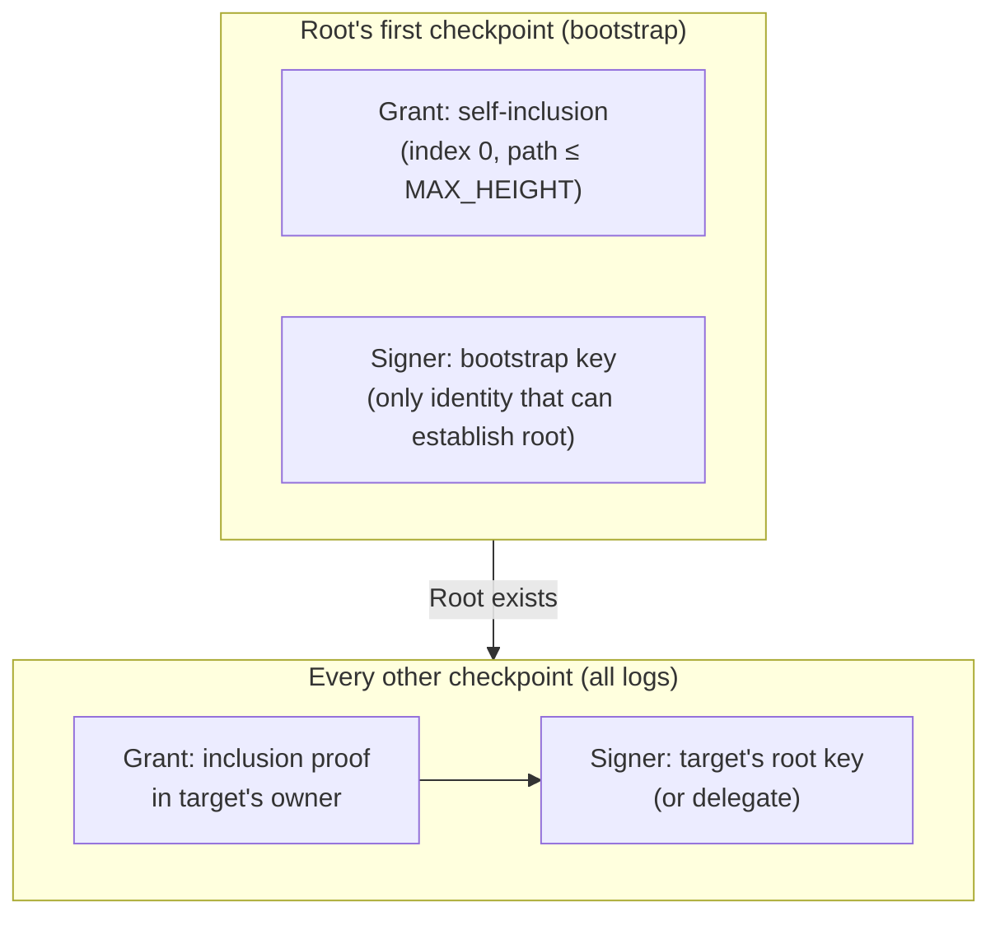

#https://dashboard.tenderly.co/sentientdogs/flip/testnet/ef72b7d9-2787-42be-8eaa-c2bf796c5c39?kind=standard ARC-0017: Authorization model overview

**Status:** DRAFT  
**Date:** 2026-02-23  
**Related:** [ARC-0017 (log hierarchy)](arc-0017-log-hierarchy-and-authority.md),
[ARC-0016](arc-0016-checkpoint-incentivisation-implementation.md),
[ADR-0004](../adr/adr-0004-root-log-self-grant-extension.md)

Succinct diagrams for the univocity authorization model. The same two
checks apply to **every** checkpoint: (1) **grant** = inclusion proof in
the target log’s **owner**, and (2) **consistency receipt** signed by the
target log’s **signer** (or, on first checkpoint, establishing it). The
only special case is the root’s first checkpoint, where there is no prior
owner and the signer must be the bootstrap key.

**Caller identity is not part of the model.** Anyone may call
`publishCheckpoint`; the contract never checks `msg.sender` for
authorization. Valid grant + validly signed checkpoint are sufficient.
Whoever pays gas is the submitter (emitted in events for attribution).

---

## 1. Log hierarchy and “owner”

Every log has an **owner** (`authLogId`): the log against which the grant
(inclusion proof) must be verified. Authority logs form a tree; data logs
are owned by an authority log.

**Rules 2 & 3:** To extend a log, the grant is always an inclusion proof
**in that log’s owner** (root → self; child authority → parent; data log
→ owning authority). First checkpoint to a new log requires
`ownerLogId` in the grant and inclusion verified against that owner.

---

## 2. Same authorization for every checkpoint

For **any** checkpoint (root, child auth, or data log; first or later),
two things are checked. The only variation is *which* owner and *which*
signer.

| Target | Owner (where grant is verified) | Signer (who must sign receipt) |
|--------|--------------------------------|--------------------------------|
| **Root, first checkpoint** | — (self-inclusion in new tree, index 0) | **Bootstrap key** (prevents front-running) |
| **Root, later** | Root (self) | Root’s stored root key |
| **Child auth, first** | Parent log | Key that will become root (stored) |
| **Child auth, later** | Parent log | Child’s stored root key |
| **Data log, first** | Owning auth log | Key that will become root (stored) |
| **Data log, later** | Owning auth log | Data log’s stored root key |

**Rule 1 (bootstrap):** Root’s first checkpoint is the one case with no
prior log; grant is self-inclusion. The signer constraint is **bootstrap
key** so only that identity can establish the root. After that, root
behaves like any other log (grant in self, signer = root’s root key).

**Rules 4 & 5:** Grant bounds (minGrowth, maxHeight) and receipt
signature verification complete the model. No role for `msg.sender`.

---

## 3. Checkpoint signers (who signs the receipt)

The **consistency receipt** is always signed by a key. The contract
verifies that signature; it does **not** verify the caller.

- **Root, first:** Receipt must be signed by the **bootstrap key**
  (contract config). No grant-based protection yet, so the signer is
  constrained to prevent front-running.
- **Any other first:** Receipt signer (or recovered root from delegation)
  is stored as that log’s **root key**. Future checkpoints to that log
  must be signed by that key (or a delegate).
- **Any later:** Receipt must verify against the **stored root key** for
  that log (or a valid delegation from it).

**msg.sender** is never used for these checks. The submitter is whoever
calls `publishCheckpoint` (and pays gas); they are only recorded in
events.

**Delegation.** Signer delegation is supported: a delegate key may sign
the consistency receipt when authorized by the log’s root key (delegation
proof). For the **first checkpoint**, the key that is **recovered** from
the receipt or from the delegation proof becomes that log’s root key; for
later checkpoints with delegation, the recovered root must match the
stored log key (and the delegate signs the receipt). Allowed algorithms
and delegation support:

| Algorithm | Description        | Delegation |
|-----------|--------------------|------------|
| **ES256** | P-256 + SHA-256    | Yes        |
| **KS256** | secp256k1 + Keccak-256 | No     |

---

## 4. Bootstrap in the same frame

Bootstrap is the **single** special case: the first checkpoint ever has no
owner log yet, so “grant in owner” becomes “self-inclusion” and “signer”
is fixed to the bootstrap key. Once the root exists, it follows the same
rules as every other log.

**Rule summary:**

| Rule | What it does |
|------|----------------|
| **1** | Root’s first: self-inclusion + receipt signer = bootstrap key. Submission permissionless. |
| **2** | Grant = inclusion proof in target log’s owner (authLogId). |
| **3** | First checkpoint to new log needs ownerLogId and inclusion in that owner. |
| **4** | Grant bounds: minGrowth, maxHeight (size-only). |
| **5** | Receipt must verify against target’s root key (or bootstrap for root’s first). |

---

## 5. What is not in the model

- **msg.sender** is not used for authorization. Any address may call
  `publishCheckpoint` with a valid grant and validly signed checkpoint.
- **Payer** is part of the grant (leaf commitment) for attribution only;
  the contract does not require `msg.sender == payer`.
- **Submitter** is whoever called the method; they are emitted in
  `CheckpointPublished` for indexing and attribution only.

The only on-chain authorization is: **grant in owner** + **receipt
signed by the correct key**.
